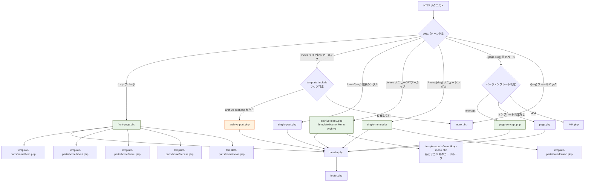

title: HanaCAFE nappa69 プロジェクト仕様書
---
version: 1.0.0
last_updated: 2026-04-07
status: 統合仕様書（SSOT）
author: 本仕様書はソースコード（PHP・JSON・SCSS）を一次情報源として解析・生成
---

# HanaCAFE nappa69 プロジェクト仕様書

> ⚠️ **情報の優先順位について**
> この仕様書は PHP / SCSS / JSON を一次情報源として生成しています。
> `docs/` 配下の既存Markdownと内容が矛盾する場合は、**本仕様書が正**です。

---

## 目次

- [1. プロジェクト概要](#1-プロジェクト概要)
- [2. テンプレート階層図](#2-テンプレート階層図)
- [3. データ構造図（CPT / ACF 関連図）](#3-データ構造図cpt--acf-関連図)
- [4. ACF フィールド完全一覧](#4-acf-フィールド完全一覧)
  - [A. common-info（page_id=218）](#a-common-infopage_id218)
  - [B. access-info（page_id=146）](#b-access-infopage_id146)
  - [C. menu-info（page_id=213）](#c-menu-infopage_id213)
  - [D. about-seats（page_id=184）](#d-about-seatspage_id184)
  - [E. CPT menu 投稿フィールド](#e-cpt-menu-投稿フィールド)
- [5. FLOCSS 設計ルール](#5-flocss-設計ルール)
  - [ディレクトリ構成](#ディレクトリ構成)
  - [Foundation（基盤）](#foundation基盤)
  - [Layout（骨格）](#layout骨格)
  - [Object / Component（汎用部品）](#object--component汎用部品)
  - [Object / Project（ページ固有）](#object--projectページ固有)
- [6. 独自ロジック・実装ハイライト（functions.php）](#6-独自ロジック実装ハイライトfunctionsphp)
- [7. JavaScript 実装ハイライト（main.js）](#7-javascript-実装ハイライトmainjs)
- [8. 既知の課題・TODO](#8-既知の課題todo)
- [9. 関連ドキュメント一覧](#9-関連ドキュメント一覧)

---

## 1. プロジェクト概要

| 項目 | 内容 |
|---|---|
| プロジェクト名 | HanaCAFE nappa69 |
| CMSプラットフォーム | WordPress 6.9 |
| テーマ名 | hanacafe-theme（カスタムテーマ） |
| 主要プラグイン | Advanced Custom Fields（ACF）/ CPT UI / Yoast SEO |
| 開発言語 | PHP 8.0+ / Dart Sass（FLOCSS）/ Vanilla JS（ES6+） |
| スタイル設計思想 | FLOCSS + BEM（SCSSレイヤー分離） |
| フォント | Montserrat + Noto Sans JP（見出し）/ Montserrat + Noto Serif JP（本文） |
| ブレークポイント | 768px（SP ↔ PC の単一ブレークポイント） |
| ビルドツール | npm scripts（ESLint / Prettier のlintのみ。Sassビルドは別途） |
| バージョン管理 | Git（コミットプレフィックス: `feat` / `fix` / `refactor` / `style`） |

### カラーパレット（`variables.scss` SSOT）

| 変数名 | HEX | 用途 |
|---|---|---|
| `$c-main` | `#2e4d07` | メインカラー（ダークグリーン）。見出し・ボタン・フッター背景 |
| `$c-accent` | `#f29159` | アクセントカラー（テラコッタ）。CTAボタン・ホバー |
| `$c-base` | `#f5f2e8` | 背景色（クリームホワイト） |
| `$c-text` | `#57534e` | 本文テキスト色 |
| `$c-white` | `#ffffff` | 白 |

---

## 2. テンプレート階層図

どのURLでどのPHPファイルが呼ばれるかを示します。
`functions.php`の`template_include`フックによるカスタムルーティングも反映しています。



> **★ カスタムルーティング（コードより確認）**
> `functions.php` の `add_filter('template_include', ...)` で `is_home()` = `/news` の時に
> `archive-post.php` を差し込んでいます。WordPressデフォルトの `home.php` は使用していません。

---

## 3. データ構造図（CPT / ACF 関連図）

カスタム投稿タイプ（CPT）とカスタムフィールド（ACF）の関連を示します。

```mermaid
erDiagram
    PAGE_common-info ||--o{ ACF_common-info : "page_id=218"
    PAGE_access-info ||--o{ ACF_access-info : "page_id=146"
    PAGE_menu-info   ||--o{ ACF_menu-info   : "page_id=213"
    PAGE_about-seats ||--o{ ACF_about-seats : "page_id=184"

    CPT_menu }o--o{ TAX_menu-category : "タクソノミー分類"
    CPT_menu ||--o{ ACF_menu-fields   : "post_type=menu"

    ACF_common-info {
        image  pic               "ヒーロー背景画像"
        image  site_default_image "全投稿共通fallback画像（REST公開）"
    }

    ACF_access-info {
        text     shop_address      "住所（JSON-LD兼用）"
        text     shop_access_note  "アクセス補足"
        text     shop_access_train1 "東急線情報"
        text     shop_access_train2 "JR線情報"
        textarea shop_open_hours   "営業時間（JSON-LD兼用）"
        text     shop_tel          "電話番号（JSON-LD兼用）"
        text     shop_closed       "定休日"
        text     seat_check_url    "空席確認URL（型:text）"
        image    shop_map_image    "地図サムネイル"
        url      shop_map_url      "Google Maps URL（JSON-LD兼用）"
        text     shop_map_btn_text "地図ボタンテキスト"
        url      shop_sns_instagram "Instagram URL（JSON-LD兼用）"
        url      shop_sns_facebook  "Facebook URL（JSON-LD兼用）"
    }

    ACF_menu-info {
        post_object top_menu_meal    "TOPピックアップ MEAL"
        post_object top_menu_drink   "TOPピックアップ DRINK"
        post_object top_menu_dessert "TOPピックアップ DESSERT"
    }

    ACF_about-seats {
        text       about_section_title  "セクションタイトル"
        textarea   about_section_text   "セクション説明文"
        radio      status_counter       "空席状態 ok/few/full"
        radio      status_table         "空席状態 ok/few/full"
        radio      status_terrace       "空席状態 ok/few/full"
        text       title_counter        "カウンター席タイトル"
        textarea   text_counter         "カウンター席説明"
        image      img_counter          "カウンター席画像"
        text       title_table          "テーブル席タイトル"
        textarea   text_table           "テーブル席説明"
        image      img_table            "テーブル席画像"
        text       title_terrace        "テラス席タイトル"
        textarea   text_terrace         "テラス席説明"
        image      img_terrace          "テラス席画像"
        true_false is_pet_terrace       "テラス ペット可フラグ"
    }

    ACF_menu-fields {
        number     price          "価格（整数）"
        text       sub_name       "サブネーム"
        true_false is_recommended "おすすめフラグ"
        image      menu_sub_img   "商品専用ビジュアル画像"
        number     calorie        "カロリー"
        checkbox   allergies      "アレルギー情報"
    }

    TAX_menu-category {
        string meal    "MEAL（slug: meal）"
        string drink   "DRINK（slug: drink）"
        string dessert "DESSERT（slug: dessert）"
    }
```



---

## 4. ACF フィールド完全一覧

> **解析方針**: `acf-fields.json` のフィールドキー・型・`location` 値を一次情報源とし、
> `functions.php` の実際の呼び出し箇所で出力先テンプレートを特定しています。
> `★` マークは `07_acf-field-reference.md` との乖離箇所です。

---

### A. common-info（page_id=218）

| フィールド名 | スラッグ | 型 | 必須 | 役割・出力先テンプレート |
|---|---|---|:---:|---|
| ヒーロー画像 | `pic` | image | ✗ | `template-parts/home/hero.php` の `` に出力。`fetchpriority="high"` でLCP対象。fallback: `assets/images/coming-soon.jpg` |
| デフォルト画像 | `site_default_image` | image | ✗ | `functions.php` の `get_hanacafe_default_image_url()` 経由でニュース・メニューの全fallback画像として機能。**★ REST API公開（`show_in_rest: 1`）** — docs未記載 |

---

### B. access-info（page_id=146）

| フィールド名 | スラッグ | 型 | 必須 | 役割・出力先テンプレート |
|---|---|---|:---:|---|
| 住所 | `shop_address` | text | ✗ | `access.php` / `footer.php` / JSON-LD の `streetAddress` に三重出力 |
| アクセス補足 | `shop_access_note` | text | ✗ | `access.php` の住所直下に補足テキストとして表示 |
| 路線情報①（東急） | `shop_access_train1` | text | ✗ | `access.php` に `wp_kses_post()` でHTMLを許可して出力（`<span class="p-access__time-number">2</span>分`等の強調が可能） |
| 路線情報②（JR） | `shop_access_train2` | text | ✗ | 同上。JR路線バッジ（`.p-access__badge--jr`）と共に表示 |
| 営業時間 | `shop_open_hours` | textarea | ✗ | `access.php` / `footer.php` / JSON-LD の `openingHours` に出力 |
| 電話番号 | `shop_tel` | text | ✗ | `footer.php` / `access.php` / JSON-LD の `telephone` に出力。`tel:` リンクの生成時はハイフンを除去処理 |
| 定休日 | `shop_closed` | text | ✗ | `access.php` の定休日欄 |
| 空席確認URL | `seat_check_url` | text | ✗ | `access.php` の「空席確認」ボタンのhref。**★ JSON上の型は `text`（`url`型ではない）** |
| 地図画像 | `shop_map_image` | image | ✗ | `access.php` のマップサムネイル（800×673px）。fallback: `assets/images/map.png` |
| Google Maps URL | `shop_map_url` | url | ✗ | 地図画像クリック時の遷移先 / JSON-LD の `hasMap` |
| 地図ボタンテキスト | `shop_map_btn_text` | text | ✗ | 地図ホバー時のオーバーレイボタン文言。**デフォルト値: `"Google Maps"`** |
| Instagram URL | `shop_sns_instagram` | url | ✗ | `footer.php` SNSリンク / JSON-LD の `sameAs` 配列に出力 |
| Facebook URL | `shop_sns_facebook` | url | ✗ | `footer.php` SNSリンク / JSON-LD の `sameAs` 配列に出力。**★ REST API公開（`show_in_rest: 1`）** |

---

### C. menu-info（page_id=213）

| フィールド名 | スラッグ | 型 | 必須 | 役割・出力先テンプレート |
|---|---|---|:---:|---|
| TOPピックアップ MEAL | `top_menu_meal` | post_object | ✗ | `template-parts/home/menu.php` の MEAL カード1件。taxonomy絞り込み: `menu_category:meal`。`get_hanacafe_top_menu_post()` 経由でACF未設定時も WP_Query でfallback取得 |
| TOPピックアップ DRINK | `top_menu_drink` | post_object | ✗ | 同上、taxonomy: `menu_category:drink` |
| TOPピックアップ DESSERT | `top_menu_dessert` | post_object | ✗ | 同上、taxonomy: `menu_category:dessert` |

---

### D. about-seats（page_id=184）

> ⚠️ **★ docs乖離あり（重要）**
> `docs/09_cms運用マニュアル.md` は座席を3種（counter/table/terrace）と記載しているが、
> `functions.php` の `$slots = ['counter', 'table', 'terrace', 'private']` に**個室（private）が4番目として存在する**。
> ただし `status_private` / `title_private` / `text_private` / `img_private` / `is_pet_private`
> はいずれも **`acf-fields.json` 未定義** のため、WordPress管理画面に入力UIが表示されない状態。
> また `is_pet_counter` / `is_pet_table` も JSONに存在せず、**`is_pet_terrace` のみ定義済み**。

| フィールド名 | スラッグ | 型 | 必須 | 役割・出力先テンプレート |
|---|---|---|:---:|---|
| セクションタイトル | `about_section_title` | text | ✗ | `template-parts/home/about.php` の `<h2>` |
| セクション説明文 | `about_section_text` | textarea | ✗ | 同セクションのリード文 |
| カウンター席 空席状態 | `status_counter` | radio | ✗ | 選択肢: `ok`（空席）/ `few`（残りわずか）/ `full`（満席）。デフォルト `ok`。バッジ modifier `.is-success / .is-alert / .is-full` を決定 |
| テーブル席 空席状態 | `status_table` | radio | ✗ | 同上 |
| テラス席 空席状態 | `status_terrace` | radio | ✗ | 同上 |
| **★ 個室 空席状態** | `status_private` | ─ | ─ | **ACF JSON 未定義**。管理画面に入力欄なし |
| カウンター席 タイトル | `title_counter` | text | ✗ | カードの `<h3>` |
| カウンター席 説明文 | `text_counter` | textarea | ✗ | カードの `<p>` |
| カウンター席 画像 | `img_counter` | image | ✗ | カード画像。fallback: `assets/images/counter.jpg` |
| テーブル席 タイトル | `title_table` | text | ✗ | 同上 |
| テーブル席 説明文 | `text_table` | textarea | ✗ | 同上 |
| テーブル席 画像 | `img_table` | image | ✗ | fallback: `assets/images/table.jpg` |
| テラス席 タイトル | `title_terrace` | text | ✗ | 同上 |
| テラス席 説明文 | `text_terrace` | textarea | ✗ | 同上 |
| テラス席 画像 | `img_terrace` | image | ✗ | fallback: `assets/images/terrace.jpg` |
| テラス席 ペット可 | `is_pet_terrace` | true_false | ✗ | `Pet Friendly` バッジ（`.c-badge-feature`）の表示ON/OFF |
| **★ カウンター ペット可** | `is_pet_counter` | ─ | ─ | **ACF JSON 未定義**。`functions.php` は `get_field('is_pet_counter', ...)` で取得試みるが常に `false` |
| **★ テーブル ペット可** | `is_pet_table` | ─ | ─ | 同上 |

---

### E. CPT menu 投稿フィールド

> 表示順制御のロジック: `archive-menu.php` の `WP_Query` で
> `orderby: ['recommend_clause' => 'DESC', 'date' => 'DESC']` を使用し、
> `is_recommended = true` の投稿を上位に表示する**2段ソート**を実装。

| フィールド名 | スラッグ | 型 | 必須 | 役割・出力先テンプレート |
|---|---|---|:---:|---|
| 価格 | `price` | number | ✗ | `c-card__price` に `¥{価格}` 形式で表示。`numberformat()` でカンマ区切り整形済み |
| サブネーム | `sub_name` | text | ✗ | カード・シングルページのサブタイトル（例: 「季節のパフェ」） |
| おすすめフラグ | `is_recommended` | true_false | ✗ | `.c-badge--recommend` の表示ON/OFF。WP_Query の `meta_query` orderby に使用し推薦品を上位表示 |
| メニュービジュアル | `menu_sub_img` | image | ✗ | サムネイルとは別の商品専用画像。fallback優先順位: **`menu_sub_img` → `post_thumbnail` → `site_default_image`** |
| カロリー | `calorie` | number | ✗ | `single-menu.php` のspecsテーブル `<dt>カロリー</dt><dd>{値}kcal</dd>` に出力 |
| アレルギー情報 | `allergies` | checkbox | ✗ | `single-menu.php` のspecsテーブルに出力。**★ JSONのchoicesラベルは抽出テキストで判読不可。管理画面で実値確認が必要** |

---

## 5. FLOCSS 設計ルール

このテーマは **FLOCSS**（Foundation / Layout / Object）に基づいてSCSSが整理されています。
`src/scss/app.scss` が全レイヤーを `@use` でまとめてビルドします。

### ディレクトリ構成

```
src/scss/
├── global/
│   ├── _variables.scss   ← 🔑 デザイントークン（色・フォント・z-index・余白の唯一の真実）
│   └── _mixins.scss      ← vw-clamp() / mq() などの再利用ミックスイン
├── foundation/
│   └── _base.scss        ← リセットCSS / body / h1〜h4 のグローバル基盤
├── layout/               ← ページ骨格（構造）
│   ├── _l-container.scss
│   ├── _l-section.scss
│   ├── _l-header.scss
│   └── _l-footer.scss
└── object/
    ├── component/        ← 汎用UI部品（どのページでも使いまわせる）
    │   ├── _c-badge.scss
    │   ├── _c-button.scss
    │   ├── _c-card.scss
    │   └── _c-heading.scss
    └── project/          ← ページ固有のセクションスタイル
        ├── _p-hero.scss
        ├── _p-about.scss
        ├── _p-menu.scss
        ├── _p-news.scss
        ├── _p-access.scss
        ├── _p-drawer.scss
        ├── _p-page.scss
        └── _p-single-menu.scss
```

---

### Foundation（基盤）

| ファイル | 担当範囲 | 解説 |
|---|---|---|
| `_variables.scss` | 全カラー・フォント・z-index・transition・border-radius の変数定義 | **「デザインの設計書」**。ここを変えるとサイト全体の色・フォントが一括変更できる。`theme.json` との整合性維持が必要 |
| `_mixins.scss` | `vw-clamp(min, max)` / `mq()` (768px以上) / `admin-bar-top()` | **「便利な道具箱」**。`vw-clamp(60, 100)` = `clamp(60px, calc(...) + ...vw, 100px)` を自動計算 |
| `_base.scss` | margin/padding リセット・body背景・フォント・h1〜h4 のグローバルスタイル | **「ゼロからの出発点」**。ブラウザのデフォルトを統一 |

---

### Layout（骨格）

サイト全体の「器」を担当します。特定のコンテンツを持たず、**どのページにも共通適用**されます。

| ファイル | 担当要素 | 主な実装ポイント |
|---|---|---|
| `_l-container.scss` | `.l-container` | max-width 1200px・左右padding SP:24px / PC:80px。`.u-alignfull` で100vw全幅抜け対応 |
| `_l-section.scss` | `.l-section` | 上下余白 `vw-clamp(60, 100)`。**Anti-Blackout設計**：`opacity: 1` をデフォルトに設定し、`.js-enabled` クラスが付与された時のみ `opacity: 0` → IntersectionObserver で `.is-inview` 付与でfadeIn |
| `_l-header.scss` | `.l-header` | `position: fixed`。スクロールで `.is-scrolled` クラスを受け取り背景色 `rgba(base, 0.95)` → `#ffffff` に遷移。`z-index: 100`。PC/SPでハンバーガーの表示切り替え |
| `_l-footer.scss` | `.l-footer` | ダークグリーン（`$c-main`）背景。SP:1列・PC:3カラムGrid（`1.2fr 1fr 1.2fr`）。SNSリンクのアクセントカラーホバー |

---

### Object / Component（汎用部品）

「どのページでも使いまわせる独立したパーツ」です。ページの文脈を持ちません。

| ファイル | クラス名 | 担当要素 | 主な実装ポイント |
|---|---|---|---|
| `_c-button.scss` | `.c-btn-capsule` | CTAボタン全般 | `border-radius: $radius-round (50px)`。`$c-accent (#f29159)` 背景。hover: `opacity:0.7` + `translateY(-2px)` + shadow増幅 |
| `_c-badge.scss` | `.c-badge-status` `.c-badge-feature` `.c-badge-recommend` | 空席・季節・おすすめバッジ | 3種を1ファイルで管理。`is-success/is-alert/is-full` でボーダー・テキストカラー変化。`z-index: $z-badge (2)` |
| `_c-heading.scss` | `.c-heading` | セクション見出し全般 | `.c-heading__sub`（英字・小・緑・`text-transform: uppercase`）＋ `.c-heading__main`（日本語・大・`vw-clamp(24, 32)`）の2段構成 |
| `_c-card.scss` | `.c-card` + modifier | メニュー・ニュース・座席カード | **modifier 3種**: `--menu`（ホバーで `translateY(-4px)`）/ `--news`（16:9 アスペクト比・テキスト3行 `-webkit-line-clamp`）/ `--seat`（`border-radius: $radius-m`・クリックカーソル） |

---

### Object / Project（ページ固有）

特定の画面・セクションにのみ登場するスタイルです。

| ファイル | 担当画面・セクション | 主な設計ポイント |
|---|---|---|
| `_p-hero.scss` | トップページ ヒーローセクション | **JS連携が最多**。`.js-enabled body .p-hero:not(.is-start)` で `opacity:0 / translateY(20px)` → `.is-start` でfadeIn。英字タイトル `transition-delay: 0.8s`、日本語サブタイトル `1.2s` の段差演出 |
| `_p-about.scss` | トップページ Aboutセクション（座席カード） | SP:1列 / PC:3列Grid。`.is-inview` でfadeIn。カードに `.c-card--seat` modifier使用 |
| `_p-menu.scss` | トップページ Menuセクション + メニューアーカイブ | アーカイブの偶数セクション（Drink / Dessert）は `::before` 擬似要素で `100vw` 全幅白背景を実装。インデントなしで全幅背景を表現する特殊実装 |
| `_p-news.scss` | Newsアーカイブページ | 3列Grid・ページネーション `.p-archive__pagination` スタイル（`.nav-links` のインラインflexボタン群） |
| `_p-access.scss` | トップページ Accessセクション | 路線バッジ（東急=`$c-main` / JR=`$c-text-sub`）の2色管理。地図画像のホバーオーバーレイ（`opacity: 0 → 1`）アニメーション |
| `_p-drawer.scss` | SP ドロワーナビ（全ページ共通） | `transform: translateX(100%)` → `translateX(0)` の横スライド。`z-index: 101`（ヘッダーより前面）。PCでは `display: none` |
| `_p-page.scss` | 固定ページ共通レイアウト（概念・プライバシーポリシー等） | **★ Anti-Blackout修正済み**: SPでの `.l-section` の `opacity: 0` 問題を `opacity: 1 !important / transform: none / transition: none` で上書き。コード内コメントに記録あり |
| `_p-single-menu.scss` | メニュー詳細ページ | SP:1列 / PC:2カラムGrid（画像左・テキスト右、`column-gap: 60px`）。specs テーブル（`<dl>`）でカロリー・アレルギーを SP:縦並び / PC:横並び表示 |

---

## 6. 独自ロジック・実装ハイライト（functions.php）

このセクションはオンラインスクールの**成果物としてアピールできる実装ポイント**をまとめています。

---

### ① Google Fonts の非同期プリロード

```php
// rel="preload" as="style" onload で CSSのレンダーブロック解消
add_filter('style_loader_tag', function($html, $handle) {
    if ($handle !== 'hanacafe-fonts') return $html;
    // preload → onload で rel="stylesheet" に切り替え
    ...
}, 20, 2);
```

`rel="preload"` + `onload="this.rel='stylesheet'"` パターンで Google Fonts のレンダーブロックを解消しつつ、`<noscript>` フォールバックを完備しています。Lighthouse の「レンダーブロッキングリソース」指摘への対処として有効です。

---

### ② ファイル mtime によるキャッシュバスター

```php
wp_enqueue_style('hanacafe-app-style', $uri . '/assets/css/app.min.css',
    ['hanacafe-fonts'],
    file_exists($dir . '/assets/css/app.min.css') ? filemtime($dir . '/assets/css/app.min.css') : null
);
```

`filemtime()` をバージョン番号として渡すことで、CSS/JSファイルを更新するたびに**自動でキャッシュが無効化**されます。手動でバージョン番号を管理する必要がありません。

---

### ③ JS の `strategy: 'defer'` 対応

```php
wp_enqueue_script('hanacafe-main-js', $uri . '/assets/js/main.js', [],
    filemtime(...), ['strategy' => 'defer', 'in_footer' => true]
);
```

WordPress 6.3 で追加された `strategy` パラメータを使用。`defer` + `in_footer: true` で JS の実行を HTML パース後まで遅延させ、FID / INP を改善しています。

---

### ④ Anti-Blackout パターン

```php
// header.php <head> 内で同期的に実行
<script>document.documentElement.classList.add('js-enabled');</script>
```

WordPress の `body_class()` を待たず、`<html>` タグに `.js-enabled` を同期付与することで FOUC（スタイル未適用コンテンツの一瞬表示）を防ぎます。SCSS では `.js-enabled` セレクタ以下にのみ `opacity: 0` を適用するため、JSが無効な環境でもコンテンツが表示されます。

---

### ⑤ `get_hanacafe_master_page_id()` — ページID一元管理

```php
function get_hanacafe_master_page_id(string $slug): int|false {
    $page = get_page_by_path($slug);
    return $page ? $page->ID : false;
}
```

ACF の `get_field()` に渡すページIDをスラッグから動的取得することで、**本番/ステージング/ローカルでDBのIDが変わっても動作**します。全データ取得関数（`get_hanacafe_access_data()` 等）がこの関数を経由します。

---

### ⑥ 多段 fallback 画像チェーン

```php
// get_hanacafe_menu_data() 内の実装
if ($sub_img) {
    $image_url = $sub_img['sizes']['large'] ?? $sub_img['url'];
} elseif (has_post_thumbnail($post_id)) {
    $thumb = wp_get_attachment_image_src(get_post_thumbnail_id($post_id), 'large');
    $image_url = $thumb ? $thumb : get_hanacafe_default_image_url('menu-info');
} else {
    $image_url = get_hanacafe_default_image_url('menu-info');
}
```

`menu_sub_img` → `post_thumbnail` → `site_default_image` の3段fallbackにより、**どの状態でも必ず画像が表示**されます。

---

### ⑦ `get_hanacafe_about_data()` — スロット動的ループ設計

```php
$slots = ['counter', 'table', 'terrace', 'private'];
foreach ($slots as $slot_slug) {
    $title = get_field("title_{$slot_slug}", $about_id);
    if (!$title) continue; // タイトル未入力 = 非表示（Blackout回避）
    ...
}
```

座席タイプをループで処理することで、将来的な**座席種類の追加が `$slots` 配列の1行追記だけ**で完結するDRY設計です。未入力スロットをスキップする制御もここに集約されています。

---

### ⑧ JSON-LD 構造化データ（LocalBusiness / Restaurant）

```php
add_action('wp_head', function() {
    if (!is_front_page()) return;
    $data = get_hanacafe_access_data();
    $schema = [
        '@context' => 'https://schema.org',
        '@type'    => ['Restaurant', 'CafeOrCoffeeShop'],
        'name'     => 'HanaCAFE nappa69',
        'address'  => [...],
        'telephone' => ...,
        'openingHours' => ...,
        'sameAs'   => [...SNS URLs],
    ];
    echo '<script type="application/ld+json">'
        . wp_json_encode($schema, JSON_UNESCAPED_UNICODE | JSON_PRETTY_PRINT)
        . '</script>';
});
```

`access-info` ACFフィールドのデータを **Google検索のリッチリザルト用のJSON-LDスキーマとして自動出力**しています。CMSでアクセス情報を更新するだけで構造化データも自動更新されるため、メンテナンスコストがゼロです。

---

### ⑨ `pre_get_posts` — メニューアーカイブ全件表示

```php
add_action('pre_get_posts', function($query) {
    if (!is_admin() && $query->is_main_query() && $query->is_post_type_archive('menu')) {
        $query->set('posts_per_page', -1);
    }
});
```

メニューCPTのアーカイブページのみ `posts_per_page = -1`（全件表示）を適用します。`is_admin()` チェックにより管理画面のQueryには影響しない安全な実装です。

---

### ⑩ `template_include` フィルター — ニュースURLのカスタムルーティング

```php
add_filter('template_include', function($template) {
    return is_home() ? (locate_template('archive-post.php') ?: $template) : $template;
});
```

WordPress がブログ投稿一覧（`is_home()`）に使う `home.php` の代わりに `archive-post.php` を読み込むよう差し替えています。これにより `archive-post.php` でパンくずリスト・ページヘッダーを含む統一されたUIが実現されています。

---

### ⑪ メニューカテゴリの表示順固定

```php
function get_hanacafe_menu_categories(): array {
    return ['meal', 'drink', 'dessert'];
}
```

`archive-menu.php` はこの関数の返却値でループし、`get_terms()` に `orderby => 'include'` を渡すことで**常に MEAL → DRINK → DESSERT の順序を保証**しています。CMSでのタクソノミー並び替え操作の影響を受けません。

---

## 7. JavaScript 実装ハイライト（main.js）

`assets/js/main.js` は jQuery を使わず **Vanilla JS（ES6+）** で実装されています。

### ① rAF スロットルによるスクロールヘッダー

```javascript
let rafId = null;
window.addEventListener('scroll', function() {
    if (rafId) return;
    rafId = requestAnimationFrame(function() {
        header.classList.toggle('is-scrolled', window.scrollY > 0);
        rafId = null;
    });
}, { passive: true });
```

`requestAnimationFrame` でスクロールイベントを **60fps に制限（rAF スロットル）** し、`{ passive: true }` でスクロールのジャンクを防いでいます。

---

### ② ドロワーのフォーカストラップ（アクセシビリティ）

```javascript
function trapFocus(e) {
    if (e.key !== 'Tab') return;
    const focusable = getFocusable(); // drawer内のフォーカス可能要素を収集
    // 最初の要素でShift+Tab → 最後にフォーカス
    // 最後の要素でTab → 最初にフォーカス
}
document.addEventListener('keydown', trapFocus); // ドロワーopen時に登録
document.removeEventListener('keydown', trapFocus); // close時に解除
```

ドロワーが開いている間はフォーカスをドロワー内に**閉じ込め（トラップ）**、閉じたら解除します。WCAG 2.1 の「2.1.2 フォーカストラップなし」に準拠しつつ、ドロワー使用中のキーボードナビゲーションを保証します。

---

### ③ IntersectionObserver によるスクロールアニメーション

```javascript
const sectionObserver = new IntersectionObserver(entries => {
    entries.forEach(entry => {
        if (entry.isIntersecting) {
            entry.target.classList.add('is-inview');
            sectionObserver.unobserve(entry.target); // 一度発火したら監視解除
        }
    });
}, { rootMargin: '0px 0px -15% 0px', threshold: 0.1 });
```

`rootMargin: '-15%'` でビューポート下端より15%上に入ったタイミングでアニメーションを発火。`unobserve()` により発火済み要素の監視を打ち切り、**パフォーマンスリークを防止**しています。

---

### ④ リサイズ時のドロワー自動クローズ

```javascript
window.addEventListener('resize', function() {
    if (resizeRafId) return;
    resizeRafId = requestAnimationFrame(function() {
        if (window.innerWidth >= 768) closeDrawer(); // PCサイズでは強制クローズ
        resizeRafId = null;
    });
});
```

SP幅でドロワーを開いたままウィンドウをリサイズしてPC幅になった場合に**ドロワーを自動クローズ**します。

---

## 8. 既知の課題・TODO

| 優先度 | 箇所 | 内容 | 対応案 |
|:---:|---|---|---|
| 🔴 高 | `acf-fields.json` | `status_private` / `title_private` / `text_private` / `img_private` が未定義。個室の管理画面に入力UIが存在しない | JSONにフィールドグループを追加し ACF でインポートして登録 |
| 🔴 高 | `acf-fields.json` | `is_pet_counter` / `is_pet_table` が未定義。`functions.php` が参照するが常に `false` になる | JSONに追加するか、`$slots` のペット可設定をterrace以外から削除 |
| 🟡 中 | `acf-fields.json` | `allergies` checkboxのchoicesラベルが抽出テキストで判読不可 | ACF管理画面で実値を確認・本仕様書のテーブルを補完 |
| 🟡 中 | `acf-fields.json` | `seat_check_url` の型が `text`（`url`型ではない）。入力値のURL形式バリデーションが効かない | 型を `url` に変更してACF再インポート。既存データの移行確認が必要 |
| 🟢 低 | `docs/09_cms.md` | 座席を3種と記載（実態は4種）。ドキュメントが現状を反映していない | 本仕様書の内容に合わせて `09_cms.md` を更新 |
| 🟢 低 | `archive-post.php` | `wp_kses_post()` で抜粋を出力しているが、抜粋内にHTML含まれない場合は `esc_html()` でも可 | セキュリティポリシーの確認後に統一 |

---

## 9. 関連ドキュメント一覧

本仕様書は「コードの実態」を記録したものです。以下の既存ドキュメントと組み合わせて使用してください。

| ドキュメント | パス | 主な内容 | この仕様書との関係 |
|---|---|---|---|
| **CMS運用マニュアル** | `docs/09_cms運用マニュアル.md` | WordPress管理画面での日常運用手順（メニュー追加・座席状態更新等）の操作ガイド | 本仕様書のACFフィールド定義（§4）を参照しながら操作する |
| **本番移行手順書** | `docs/08_本番移行手順書.md` | All-in-One WP Migration による本番デプロイ手順・DNS設定・wp-config.php 変更手順 | 本仕様書の構成概要（§1）を前提知識として参照 |
| **アーキテクチャ・設計ルール** | `docs/01_architecture-and-design-rules.md` | テーマ全体の設計思想・FLOCSS / BEM ルール・CSS SSOT方針 | 本仕様書 §5（FLOCSS設計）の「なぜそう設計したか」の補足として参照 |
| **WordPressコーディング規約** | `docs/02_wordpress-coding-standards.md` | PHP・SCSS・JS のコーディング規約・エスケープ関数使用ルール・Git運用ルール | 新規開発者が本仕様書を読んだ後に必ず参照 |
| **ロードマップ** | `docs/04_roadmap.md` | 開発フェーズと今後の機能追加計画 | 本仕様書の §8（既知の課題）と照合して優先順位を判断 |
| **SEO動作確認チェックリスト** | `docs/10_SEOチェックリスト.md` | Chrome DevTools を使った本番SEO確認スクリプト集 | JSON-LD構造化データ（§6 ⑧）の出力確認に使用 |

---

### 📋 引き継ぎ時のクイックスタート

新しいエンジニアが本プロジェクトを引き継ぐ際の推奨読書順序：

```
1. 本仕様書 §1（概要）     ← 全体像を把握
2. 本仕様書 §2（テンプレート階層図）← どのURLでどのファイルが動くかを理解
3. 本仕様書 §3・4（データ構造）    ← CMSのデータの持ち方を理解
4. docs/02_wordpress-coding-standards.md ← 開発ルールを確認
5. 本仕様書 §5（FLOCSS）          ← CSSの書き方を理解
6. 本仕様書 §6・7（実装ハイライト）← 独自ロジックの把握
7. docs/08_本番移行手順書.md       ← デプロイ方法の確認
8. docs/09_cms運用マニュアル.md    ← クライアントへの引き渡し方確認
```

---

*この仕様書は `acf-fields.json` / `cptui-post-types.json` / `functions.php` / `src/scss/` ディレクトリを一次情報源として解析・生成しました。コードの実態と乖離を発見した場合は、コードを優先し本仕様書を更新してください。*