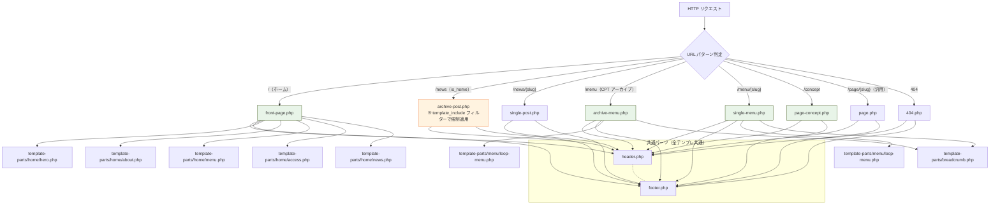
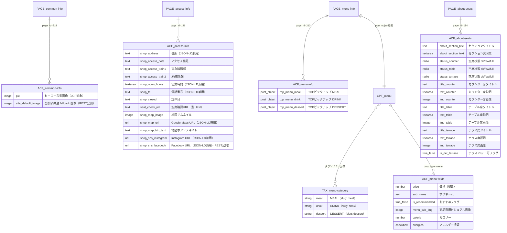

# HanaCAFE nappa69 プロジェクト仕様書

## 目次

- [1. プロジェクト概要](#1-プロジェクト概要)
- [2. テンプレート階層図](#2-テンプレート階層図)
- [3. データ構造図（CPT / ACF 関連図）](#3-データ構造図cpt--acf-関連図)
- [4. ACF フィールド完全一覧](#4-acf-フィールド完全一覧)
  - [A. common-info（page_id=218）](#a-common-infopage_id218)
  - [B. access-info（page_id=146）](#b-access-infopage_id146)
  - [C. menu-info（page_id=213）](#c-menu-infopage_id213)
  - [D. about-seats（page_id=184）](#d-about-seatspage_id184)
  - [E. CPT menu 投稿フィールド](#e-cpt-menu-投稿フィールド)
- [5. FLOCSS 設計ルール](#5-flocss-設計ルール)
  - [ディレクトリ構成](#ディレクトリ構成)
  - [Foundation（基盤）](#foundation基盤)
  - [Layout（骨格）](#layout骨格)
  - [Object / Component（汎用部品）](#object--component汎用部品)
  - [Object / Project（ページ固有）](#object--projectページ固有)
- [6. 主要ロジック仕様（functions.php）](#6-主要ロジック仕様functionsphp)
- [7. JavaScript 仕様（main.js）](#7-javascript-仕様mainjs)
- [8. 関連ドキュメント一覧](#8-関連ドキュメント一覧)

---

## 1. プロジェクト概要

| 項目 | 内容 |
|---|---|
| プロジェクト名 | HanaCAFE nappa69 |
| CMSプラットフォーム | WordPress 6.9 |
| テーマ名 | hanacafe-theme（カスタムテーマ） |
| 主要プラグイン | Advanced Custom Fields（ACF）/ CPT UI / Yoast SEO |
| 開発言語 | PHP 8.0+ / Dart Sass（FLOCSS）/ Vanilla JS（ES6+） |
| スタイル設計 | FLOCSS + BEM（SCSSレイヤー分離） |
| フォント | Montserrat + Noto Sans JP（見出し）/ Montserrat + Noto Serif JP（本文・説明文） |
| ブレークポイント | 768px（SP ↔ PC の単一ブレークポイント） |
| ビルドツール | npm scripts（ESLint / Prettier / Sass lint） |
| バージョン管理 | Git（コミットプレフィックス: `feat` / `fix` / `refactor` / `style`） |

### カラーパレット（`variables.scss` SSOT）

| 変数名 | HEX | 用途 |
|---|---|---|
| `$c-main` | `#2e4d07` | メインカラー（ダークグリーン）。見出し・ボタン・フッター背景 |
| `$c-accent` | `#f29159` | アクセントカラー（テラコッタ）。CTAボタン・ホバー |
| `$c-base` | `#f5f2e8` | 背景色（クリームホワイト） |
| `$c-text` | `#57534e` | 本文テキスト色 |
| `$c-white` | `#ffffff` | 白 |

---

## 2. テンプレート階層図



`functions.php` の `add_filter('template_include', ...)` により、`is_home()`（`/news`）時に `archive-post.php` を適用する。WordPress デフォルトの `home.php` は使用しない。

---

## 3. データ構造図（CPT / ACF 関連図）



---

## 4. ACF フィールド完全一覧

### A. common-info（page_id=218）

グループID: `group_69bd1ba995c3a`（ヒーロー画像）+ `group_69b8cb958bcba`（共通設定）

| フィールド名 | スラッグ | 型 | 役割・出力先テンプレート |
|---|---|---|---|
| ヒーロー画像 | `pic` | image | `template-parts/home/hero.php` の `` に出力。`fetchpriority="high"` でLCP対象。未設定時: `assets/images/coming-soon.jpg` |
| デフォルト画像 | `site_default_image` | image | `get_hanacafe_default_image_url()` 経由でニュース・メニューの全フォールバック画像として機能。REST API公開（`show_in_rest: 1`） |

---

### B. access-info（page_id=146）

グループID: `group_69b626794963e`

`get_hanacafe_access_data()` が連想配列を返し、テンプレート側で `!empty()` を評価する。値が空文字または未設定の場合、対応する表示ブロックごと非表示となる。`show_in_rest: 1` により全フィールドが REST API 経由で公開され、JSON-LD スキーマ生成と連携する。

| フィールド名 | スラッグ | 型 | 役割・出力先テンプレート | `!empty` ガード |
|---|---|---|---|:---:|
| 住所 | `shop_address` | text | `access.php` / `footer.php` / JSON-LD `streetAddress` | ✓ |
| アクセス補足 | `shop_access_note` | text | `access.php` 住所直下の補足テキスト | ✓ |
| 路線情報①（東急） | `shop_access_train1` | text | `access.php`。`wp_kses_post()` でHTMLスパン許可 | ✓ |
| 路線情報②（JR） | `shop_access_train2` | text | `access.php`（`.p-access__badge--jr`）。JR路線バッジと共に表示 | ✓（train1 ガード内） |
| 営業時間 | `shop_open_hours` | textarea | `access.php` / `footer.php` / JSON-LD `openingHours` | ✓ |
| 電話番号 | `shop_tel` | text | `footer.php` / `access.php` / JSON-LD `telephone`。`tel:` リンク生成時はハイフン除去処理あり | ✓ |
| 定休日 | `shop_closed` | text | `access.php` の定休日欄 | ✓ |
| 空席確認URL | `seat_check_url` | text | `access.php` の「空席確認」ボタンの `href`。外部URL時 `target="_blank"` 付与 | ✓ |
| 地図画像 | `shop_map_image` | image | `access.php` のマップサムネイル（800×673px）。未設定時: `assets/images/map.png` | — |
| Google Maps URL | `shop_map_url` | url | 地図画像クリック時の遷移先 / JSON-LD `hasMap` | ✓（URLあり時のみリンク化） |
| 地図ボタンテキスト | `shop_map_btn_text` | text | 地図ホバー時のオーバーレイボタン文言。未設定時デフォルト: `"Google Maps"` | — |
| Instagram URL | `shop_sns_instagram` | url | `footer.php` SNSリンク / JSON-LD `sameAs` | ✓ |
| Facebook URL | `shop_sns_facebook` | url | `footer.php` SNSリンク / JSON-LD `sameAs`。REST API公開（`show_in_rest: 1`） | ✓ |

---

### C. menu-info（page_id=213）

グループID: `group_69ae83eea8ead`

| フィールド名 | スラッグ | 型 | 役割・出力先テンプレート |
|---|---|---|---|
| TOPピックアップ MEAL | `top_menu_meal` | post_object | `template-parts/home/menu.php` の MEAL カード1件。`get_hanacafe_top_menu_post()` 経由でACF未設定時も `WP_Query`（taxonomy: `menu_category:meal`）でフォールバック取得 |
| TOPピックアップ DRINK | `top_menu_drink` | post_object | 同上（taxonomy: `menu_category:drink`） |
| TOPピックアップ DESSERT | `top_menu_dessert` | post_object | 同上（taxonomy: `menu_category:dessert`） |

---

### D. about-seats（page_id=184）

グループID: `group_69a7b42fd29e7`

座席種別は **counter / table / terrace の3種**。`get_hanacafe_about_data()` の `$slots` 配列で定義される。

#### 空席バッジ判定ロジック

| `status` 値 | バッジラベル | CSS修飾子 | Material アイコン |
|---|---|---|---|
| `ok` | 空席あり | `.is-ok`（= `.is-success`） | `check_circle` |
| `few` | 残りわずか | `.is-few`（= `.is-alert`） | `error` |
| `full` | 満席 | `.is-full` | `cancel` |

#### フィールド一覧

| フィールド名 | スラッグ | 型 | 役割・出力先テンプレート |
|---|---|---|---|
| セクションタイトル | `about_section_title` | text | `template-parts/home/about.php` の `<h2>`。未設定時: デフォルト文字列 |
| セクション説明文 | `about_section_text` | textarea | 同セクションのリード文。未設定時: デフォルト文字列 |
| カウンター席 空席状態 | `status_counter` | radio | 選択肢: `ok` / `few` / `full`。デフォルト: `ok` |
| テーブル席 空席状態 | `status_table` | radio | 同上 |
| テラス席 空席状態 | `status_terrace` | radio | 同上 |
| カウンター席 タイトル | `title_counter` | text | カードの `<h3>`。未入力時: そのスロットの出力をスキップ |
| カウンター席 説明文 | `text_counter` | textarea | カードの `<p>` |
| カウンター席 画像 | `img_counter` | image | カード画像。未設定時: `assets/images/counter.jpg` |
| テーブル席 タイトル | `title_table` | text | 未入力時: スキップ |
| テーブル席 説明文 | `text_table` | textarea | |
| テーブル席 画像 | `img_table` | image | 未設定時: `assets/images/table.jpg` |
| テラス席 タイトル | `title_terrace` | text | 未入力時: スキップ |
| テラス席 説明文 | `text_terrace` | textarea | |
| テラス席 画像 | `img_terrace` | image | 未設定時: `assets/images/terrace.jpg` |
| テラス席 ペット可 | `is_pet_terrace` | true_false | `true` 時に `Pet Friendly` バッジ（`.c-badge-feature`）を表示。terrace にのみ定義 |

---

### E. CPT menu 投稿フィールド

`archive-menu.php` の `WP_Query` は `orderby: ['recommend_clause' => 'DESC', 'date' => 'DESC']` による2段ソートを適用し、`is_recommended = true` の投稿を上位に表示する。

| フィールド名 | スラッグ | 型 | 役割・出力先テンプレート |
|---|---|---|---|
| 価格 | `price` | number | `c-card__price` に `¥{価格}` 形式で表示。`number_format()` でカンマ区切り整形済み |
| サブネーム | `sub_name` | text | カード・シングルページのサブタイトル |
| おすすめフラグ | `is_recommended` | true_false | `.c-badge--recommend` の表示ON/OFF。`WP_Query` の `meta_query` `orderby` に使用 |
| メニュービジュアル | `menu_sub_img` | image | サムネイルとは別の商品専用画像。フォールバック優先順位: `menu_sub_img` → `post_thumbnail` → `site_default_image` |
| カロリー | `calorie` | number | `single-menu.php` の specs テーブル `<dt>カロリー</dt><dd>{値}kcal</dd>` に出力 |
| アレルギー情報 | `allergies` | checkbox | `single-menu.php` の specs テーブルに出力。`implode(', ', $allergies)` で連結 |

---

## 5. FLOCSS 設計ルール

`src/scss/app.scss` が全レイヤーを `@use` でまとめてビルドする単一エントリーポイント。

### ディレクトリ構成

```
src/scss/
├── global/
│   ├── _variables.scss   ← デザイントークン（色・透過色・フォント・z-index・余白）の唯一の定義元（SSOT）
│   └── _mixins.scss      ← vw-clamp() / mq(768px) / admin-bar-top() の3ミックスイン
├── foundation/
│   └── _base.scss        ← margin/paddingリセット / body・h1〜h4 のグローバル基盤スタイル
├── layout/
│   ├── _l-container.scss ← max-width 1200px・左右padding の一元管理（.u-alignfull 全幅対応）
│   ├── _l-section.scss   ← セクション上下余白 + Anti-Blackout fadeIn 制御（.js-enabled / .is-inview）
│   ├── _l-header.scss    ← position:fixed・.is-scrolled 背景変化・SP/PCハンバーガー表示切替（z-index:100）
│   └── _l-footer.scss    ← $c-main背景・SP1列/PC3カラムGrid・SNSリンクホバー
└── object/
    ├── component/
    │   ├── _c-badge.scss       ← 空席(is-ok/is-few/is-full)・おすすめ・季節バッジ（3種）z-index:$z-badge
    │   ├── _c-button.scss      ← $c-accentカプセルCTAボタン（border-radius:$radius-round）
    │   ├── _c-card.scss        ← menu/news/seat カード（modifier 3種）・hover:translateY(-4px)
    │   └── _c-heading.scss     ← 英字サブ(Noto Sans) + 日本語メイン(Noto Serif) 2段見出し
    └── project/
        ├── _p-hero.scss        ← MV fadeIn・英字0.8s/日本語1.2s 段差テキストアニメーション
        ├── _p-about.scss       ← 座席カード SP:1列/PC:3列Grid・.is-inview fadeIn
        ├── _p-menu.scss        ← TOPピックアップ3枚 + アーカイブ偶数セクション全幅白背景(::before)
        ├── _p-news.scss        ← ニュース3列Grid・ページネーション(.nav-links)
        ├── _p-access.scss      ← 路線バッジ2色（東急=$c-main / JR=$c-text-sub）・地図ホバーオーバーレイ
        ├── _p-drawer.scss      ← SP横スライドドロワー translateX(100%→0)・z-index:$z-drawer(101)
        ├── _p-page.scss        ← 固定ページ fadeIn 無効化（opacity:1 !important / transform:none）
        └── _p-single-menu.scss ← メニュー詳細 SP:1列/PC:2カラムGrid・specsテーブル(dl)
```

---

### Foundation（基盤）

| ファイル | 担当範囲 |
|---|---|
| `_variables.scss` | テーマ全体のデザイントークンを一元管理する唯一の定義元。色・透明色・フォント族・z-index・transition・border-radius をすべて定義する。直接値の記述は禁止 |
| `_mixins.scss` | `vw-clamp(min, max)`（fluid サイズ計算）、`mq`（768px メディアクエリ）、`admin-bar-top`（WP 管理バーオフセット）の3ミックスインを提供する |
| `_base.scss` | margin/padding リセット、`body`（背景・文字色・行高）、`h1〜h4`（フォント族・clamp サイズ）、`a`・`img`・`button` のデフォルトを定義する |

**`variables.scss` 変数管理ルール**

| カテゴリ | 変数例 | ルール |
|---|---|---|
| ブランドカラー（実値） | `$c-main: #2e4d07` | 5色のみ直接 hex 定義 |
| 透明色（派生） | `$c-text-sub: rgba($c-text, 0.7)` | 基底変数から `rgba()` で派生。直接 hex 禁止 |
| タイポグラフィ | `$f-heading`, `$f-body` | フォントスタック2種のみ |
| z-index | `$z-header: 100`, `$z-drawer: 101` | 全レイヤーをここで一元管理 |
| トランジション | `$t-duration: 0.3s` | 全アニメーション共通基準値 |
| ボーダー半径 | `$radius-s: 4px`, `$radius-m: 8px`, `$radius-round: 50px` | 3段階のみ |

---

### Layout（骨格）

`l-` プレフィックス。ページ骨格の配置・構造を担保し、色・フォントのスタイルは持たない。全ページに共通適用される。

| ファイル | 担当要素 | 主な実装ポイント |
|---|---|---|
| `_l-container.scss` | `.l-container` | max-width 1200px・左右padding SP:24px / PC:80px。`.u-alignfull` で100vw全幅抜け対応 |
| `_l-section.scss` | `.l-section` | 上下余白 `vw-clamp(60, 100)`。**Anti-Blackout設計**：`opacity: 1` をデフォルトとし、`.js-enabled` クラスが付与された時のみ `opacity: 0` → IntersectionObserver で `.is-inview` 付与でfadeIn |
| `_l-header.scss` | `.l-header` | `position: fixed`。スクロールで `.is-scrolled` クラスを受け取り背景色を `rgba(base, 0.95)` → `#ffffff` に遷移。`z-index: 100`。PC/SPでハンバーガーの表示切り替え |
| `_l-footer.scss` | `.l-footer` | `$c-main` 背景。SP:1列・PC:3カラムGrid（`1.2fr 1fr 1.2fr`）。SNSリンクのアクセントカラーホバー |

---

### Object / Component（汎用部品）

`c-` プレフィックス。出現場所に依存しない再利用単位。色・サイズはすべて `variables.scss` の変数経由。

| ファイル | クラス名 | 担当要素 | 主な実装ポイント |
|---|---|---|---|
| `_c-button.scss` | `.c-btn-capsule` | CTAボタン全般 | `border-radius: $radius-round`。`$c-accent` 背景色。hover: `opacity: 0.7` + `translateY(-2px)` + shadow |
| `_c-badge.scss` | `.c-badge-status` `.c-badge-feature` `.c-badge-recommend` | 空席・季節・おすすめバッジ | 3種を1ファイルで管理。`is-success/is-alert/is-full` でボーダー・テキストカラー変化。`z-index: $z-badge (2)` |
| `_c-heading.scss` | `.c-heading` | セクション見出し全般 | `.c-heading__sub`（英字・小・緑・`text-transform: uppercase`）+ `.c-heading__main`（日本語・大・`vw-clamp(24, 32)`）の2段構成 |
| `_c-card.scss` | `.c-card` + modifier | メニュー・ニュース・座席カード | modifier 3種: `--menu`（hover: `translateY(-4px)`）/ `--news`（16:9 アスペクト比・テキスト3行 `-webkit-line-clamp`）/ `--seat`（`border-radius: $radius-m`） |

---

### Object / Project（ページ固有）

`p-` プレフィックス。特定の画面・セクションに紐づく固有スタイル。

| ファイル | 担当画面・セクション | 主な設計ポイント |
|---|---|---|
| `_p-hero.scss` | トップページ ヒーローセクション | `.js-enabled body .p-hero:not(.is-start)` で `opacity:0 / translateY(20px)` → `.is-start` でfadeIn。英字タイトル `transition-delay: 0.8s`、日本語サブタイトル `1.2s` の段差演出 |
| `_p-about.scss` | トップページ Aboutセクション（座席カード） | SP:1列 / PC:3列Grid。`.is-inview` でfadeIn。カードに `.c-card--seat` modifier使用 |
| `_p-menu.scss` | トップページ Menuセクション + メニューアーカイブ | アーカイブの偶数セクション（Drink / Dessert）は `::before` 擬似要素で `100vw` 全幅白背景を実装 |
| `_p-news.scss` | Newsアーカイブページ | 3列Grid・ページネーション `.p-archive__pagination`（`.nav-links` のインラインflexボタン群） |
| `_p-access.scss` | トップページ Accessセクション | 路線バッジ（東急=`$c-main` / JR=`$c-text-sub`）の2色管理。地図画像のホバーオーバーレイ（`opacity: 0 → 1`）アニメーション |
| `_p-drawer.scss` | SP ドロワーナビ（全ページ共通） | `transform: translateX(100%)` → `translateX(0)` の横スライド。`z-index: 101`（ヘッダーより前面）。PCでは `display: none` |
| `_p-page.scss` | 固定ページ共通レイアウト（概念・プライバシーポリシー等） | SP での `.l-section` に対し `opacity: 1 !important / transform: none / transition: none` を適用し、フェードアニメーションの対象外とする |
| `_p-single-menu.scss` | メニュー詳細ページ | SP:1列 / PC:2カラムGrid（画像左・テキスト右、`column-gap: 60px`）。specs テーブル（`<dl>`）でカロリー・アレルギーを SP:縦並び / PC:横並び表示 |

---

## 6. 主要ロジック仕様（functions.php）

---

### ① Google Fonts の非同期プリロード

```php
add_filter('style_loader_tag', function($html, $handle) {
    if ($handle !== 'hanacafe-fonts') return $html;
    // rel="preload" as="style" onload="this.rel='stylesheet'" パターンで出力
    // <noscript> フォールバックを付与
}, 20, 2);
```

`rel="preload"` + `onload="this.rel='stylesheet'"` パターンで Google Fonts のレンダーブロッキングを回避する。`<noscript>` フォールバックを完備する。

---

### ② ファイル mtime によるキャッシュバスター

```php
wp_enqueue_style('hanacafe-app-style', $uri . '/assets/css/app.min.css',
    ['hanacafe-fonts'],
    file_exists($dir . '/assets/css/app.min.css') ? filemtime($dir . '/assets/css/app.min.css') : null
);
```

`filemtime()` をバージョン番号として渡すことで、ファイル更新時に自動でキャッシュを無効化する。

---

### ③ JS の `strategy: 'defer'` 対応

```php
wp_enqueue_script('hanacafe-main-js', $uri . '/assets/js/main.js', [],
    filemtime(...), ['strategy' => 'defer', 'in_footer' => true]
);
```

WordPress 6.3 の `strategy` パラメータを使用。`defer` + `in_footer: true` で JS の実行を HTML パース後まで遅延し、FID / INP の最小化を担保する。

---

### ④ Anti-Blackout パターン

```php
// header.php <head> 内で同期的に実行
<script>document.documentElement.classList.add('js-enabled');</script>
```

`<html>` タグに `.js-enabled` を同期付与することで FOUC（スタイル未適用コンテンツの一瞬表示）を防ぐ。SCSS では `.js-enabled` セレクタ以下にのみ `opacity: 0` を適用するため、JS無効環境でもコンテンツは表示される。

---

### ⑤ `get_hanacafe_master_page_id()` — ページID動的解決

```php
function get_hanacafe_master_page_id(string $slug): int|false {
    $page = get_page_by_path($slug);
    return $page ? $page->ID : false;
}
```

ACF の `get_field()` に渡すページIDをスラッグから動的取得する。本番/ステージング/ローカルでDBのIDが変わっても動作する。全データ取得関数（`get_hanacafe_access_data()` 等）がこの関数を経由する。

---

### ⑥ 多段フォールバック画像チェーン

```php
// get_hanacafe_menu_data() 内の実装
if ($sub_img) {
    $image_url = $sub_img['sizes']['large'] ?? $sub_img['url'];
} elseif (has_post_thumbnail($post_id)) {
    $thumb = wp_get_attachment_image_src(get_post_thumbnail_id($post_id), 'large');
    $image_url = $thumb ? $thumb : get_hanacafe_default_image_url('menu-info');
} else {
    $image_url = get_hanacafe_default_image_url('menu-info');
}
```

`menu_sub_img` → `post_thumbnail` → `site_default_image` の3段フォールバックにより、どの設定状態でも画像が表示される。

---

### ⑦ `get_hanacafe_about_data()` — スロット動的ループ

```php
$slots = ['counter', 'table', 'terrace'];
foreach ($slots as $slot_slug) {
    $title = get_field("title_{$slot_slug}", $about_id);
    if (!$title) continue; // タイトル未入力スロットはスキップ
    // status / text / image / is_pet の取得・正規化
}
```

座席タイプをループで処理することで、`$slots` 配列の変更のみで対応座席種を制御できるDRY設計。`is_pet` フラグは terrace のみ ACF フィールドが存在し、counter / table は `false` 固定で返却する。未入力スロットのスキップ制御もこの関数に集約される。

---

### ⑧ JSON-LD 構造化データ（LocalBusiness / Restaurant）

```php
add_action('wp_head', function() {
    if (!is_front_page()) return;
    $data = get_hanacafe_access_data();
    $schema = [
        '@context' => 'https://schema.org',
        '@type'    => ['Restaurant', 'CafeOrCoffeeShop'],
        'name'     => 'HanaCAFE nappa69',
        'address'  => [...],
        'telephone' => ...,
        'openingHours' => ...,
        'sameAs'   => [...SNS URLs],
    ];
    echo '<script type="application/ld+json">'
        . wp_json_encode($schema, JSON_UNESCAPED_UNICODE | JSON_PRETTY_PRINT)
        . '</script>';
});
```

`access-info` ACFフィールドのデータを Google 検索向け JSON-LD スキーマとして自動出力する。CMS でアクセス情報を更新すると構造化データも自動更新される。

---

### ⑨ `pre_get_posts` — メニューアーカイブ全件表示

```php
add_action('pre_get_posts', function($query) {
    if (!is_admin() && $query->is_main_query() && $query->is_post_type_archive('menu')) {
        $query->set('posts_per_page', -1);
    }
});
```

メニューCPTのアーカイブページのみ `posts_per_page = -1`（全件表示）を適用する。`is_admin()` チェックにより管理画面のQueryには影響しない。

---

### ⑩ `add_rewrite_rule` — `/news/{slug}` パターンの登録

```php
add_action('init', function() {
    add_rewrite_rule(
        'news/([^/]+)/?$',
        'index.php?name=$matches',[1]
        'top'
    );
});
```

WordPress のデフォルトルールより優先（`'top'`）で `news/{slug}` を単一投稿ルーティングに解決する。変更後は管理画面「設定 → パーマリンク」を一度保存し、リライトルールをフラッシュすること。

---

### ⑪ `post_link` フィルター — フロントエンド URL への `/news/` 付与

```php
add_filter('post_link', function($url, $post) {
    if ($post->post_type === 'post') {
        $url = home_url('/news/' . $post->post_name . '/');
    }
    return $url;
}, 10, 2);
```

`get_permalink()` が返す投稿 URL を `/news/{slug}/` 形式に変換する。テンプレート・ウィジェット・サイトマップ等すべての `get_permalink()` 呼び出しに自動適用される。

---

### ⑫ `get_sample_permalink` フィルター — 管理画面プレビュー URL の同期

```php
add_filter('get_sample_permalink', function($permalink, $post_id) {
    $post = get_post($post_id);
    if ($post && $post->post_type === 'post') {
        $permalink = home_url('/news/%postname%/');
    }
    return $permalink;
}, 10, 2);
```

管理画面の「パーマリンク」欄と「プレビュー」ボタンの URL を `/news/` 形式に同期する。`post_link` フィルターのみでは管理画面の表示が旧 URL のままになるため、このフィルターが必須。

---

### ⑬ `template_include` フィルター — ニュース一覧テンプレートの切替

```php
add_filter('template_include', function($template) {
    return is_home() ? (locate_template('archive-post.php') ?: $template) : $template;
});
```

WordPress がブログ投稿一覧（`is_home()`）に使う `home.php` の代わりに `archive-post.php` を読み込む。これによりパンくずリスト・ページヘッダーを含む統一された UI が実現される。

---

### ⑭ メニューカテゴリの表示順固定

```php
function get_hanacafe_menu_categories(): array {
    return ['meal', 'drink', 'dessert'];
}
```

`archive-menu.php` はこの関数の返却値でループし、`get_terms()` に `orderby => 'include'` を渡すことで常に MEAL → DRINK → DESSERT の順序を保証する。

---

## 7. JavaScript 仕様（main.js）

`assets/js/main.js` は jQuery を使わず Vanilla JS（ES6+）で実装される。

### ① rAF スロットルによるスクロールヘッダー

```javascript
let rafId = null;
window.addEventListener('scroll', function() {
    if (rafId) return;
    rafId = requestAnimationFrame(function() {
        header.classList.toggle('is-scrolled', window.scrollY > 0);
        rafId = null;
    });
}, { passive: true });
```

`requestAnimationFrame` でスクロールイベントを60fps相当に制限し、`{ passive: true }` でスクロールのジャンクを防ぐ。

---

### ② ドロワーのフォーカストラップ

```javascript
function trapFocus(e) {
    if (e.key !== 'Tab') return;
    const focusable = getFocusable();
    // 最初の要素でShift+Tab → 最後にフォーカス
    // 最後の要素でTab → 最初にフォーカス
}
document.addEventListener('keydown', trapFocus);    // ドロワーopen時に登録
document.removeEventListener('keydown', trapFocus); // close時に解除
```

ドロワーが開いている間はフォーカスをドロワー内に閉じ込め、閉じたら解除する。WCAG 2.1「2.1.2 フォーカストラップなし」に準拠しつつ、ドロワー使用中のキーボードナビゲーションを保証する。

---

### ③ IntersectionObserver によるスクロールアニメーション

```javascript
const sectionObserver = new IntersectionObserver(entries => {
    entries.forEach(entry => {
        if (entry.isIntersecting) {
            entry.target.classList.add('is-inview');
            sectionObserver.unobserve(entry.target);
        }
    });
}, { rootMargin: '0px 0px -15% 0px', threshold: 0.1 });
```

`rootMargin: '-15%'` でビューポート下端より15%上に入ったタイミングでアニメーションを発火する。`unobserve()` により発火済み要素の監視を打ち切る。

---

### ④ リサイズ時のドロワー自動クローズ

```javascript
window.addEventListener('resize', function() {
    if (resizeRafId) return;
    resizeRafId = requestAnimationFrame(function() {
        if (window.innerWidth >= 768) closeDrawer();
        resizeRafId = null;
    });
});
```

SP幅でドロワーを開いたままウィンドウをPC幅にリサイズした場合にドロワーを自動クローズする。

---

## 8. 関連ドキュメント一覧

| ドキュメント | パス | 主な内容 |
|---|---|---|
| **CMS運用マニュアル** | `docs/CMS運用マニュアル.md` | WordPress管理画面での日常運用手順（メニュー追加・座席状態更新等）の操作ガイド |
| **本番移行手順書** | `docs/本番移行手順書.md` | All-in-One WP Migration による本番デプロイ手順・DNS設定・wp-config.php 変更手順 |
| **アーキテクチャ設計** | `docs/アーキテクチャ設計.md` | テーマ全体の設計思想・FLOCSS / BEM ルール・CSS SSOT方針 |
| **コーディング規約** | `docs/コーディング規約.md` | PHP・SCSS・JS のコーディング規約・エスケープ関数使用ルール・Git運用ルール |
| **品質チェックリスト** | `docs/品質チェックリスト.md` | Chrome DevTools を使った本番公開前後の確認手順 |

### 引き継ぎ時の推奨読書順序

```
1. 本仕様書 §1（概要）              ← 全体像を把握
2. 本仕様書 §2（テンプレート階層図） ← URLとファイルの対応を理解
3. 本仕様書 §3・4（データ構造）     ← CMSのデータの持ち方を理解
4. docs/コーディング規約.md         ← 開発ルールを確認
5. 本仕様書 §5（FLOCSS）           ← CSSの書き方を理解
6. 本仕様書 §6・7（実装仕様）       ← 独自ロジックの把握
7. docs/本番移行手順書.md           ← デプロイ方法の確認
8. docs/CMS運用マニュアル.md        ← クライアントへの引き渡し方確認
```

---

*本仕様書は `acf-fields.json` / `cptui-post-types.json` / `cptui-taxonomies.json` / `theme.json` / `functions.php` / `src/scss/` を一次情報源とする。コードの実態と乖離を発見した場合は、コードを優先し本仕様書を更新すること。*
